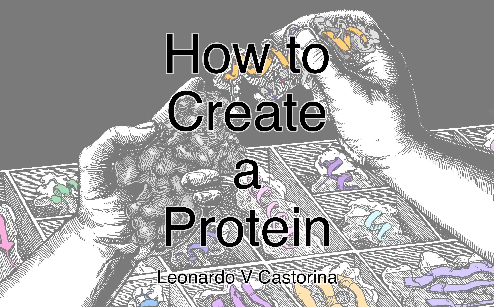
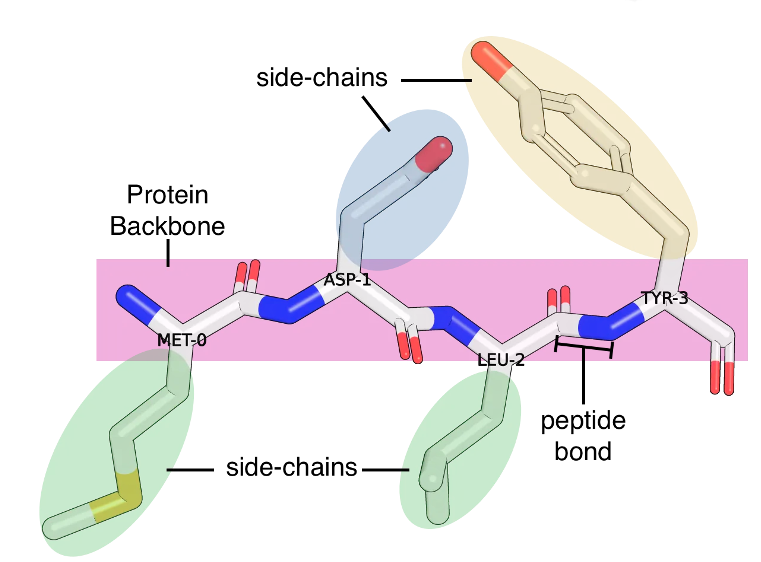
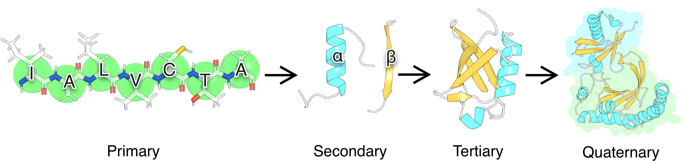
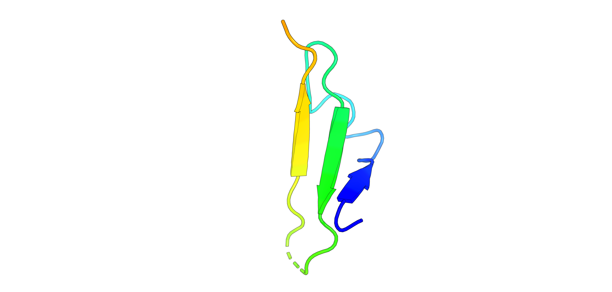
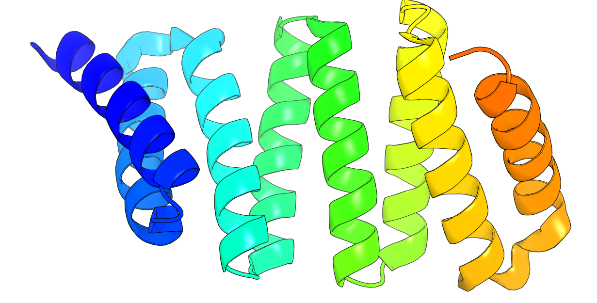
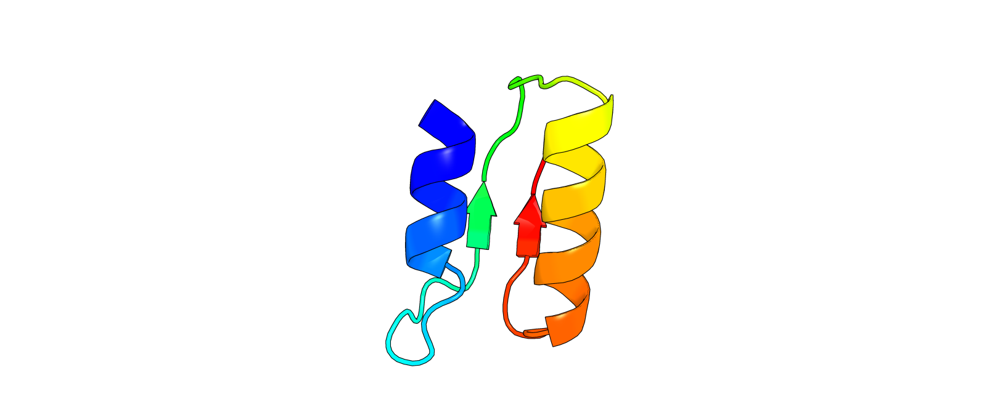
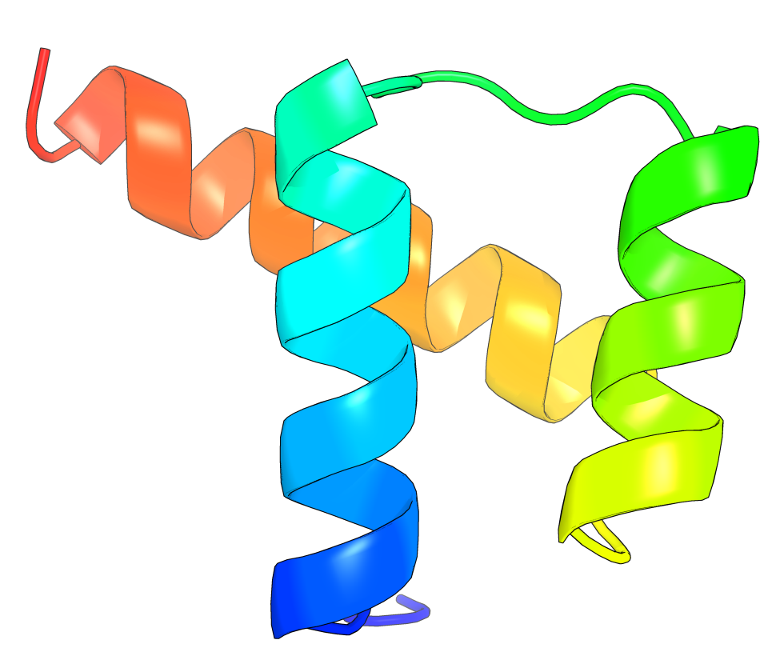
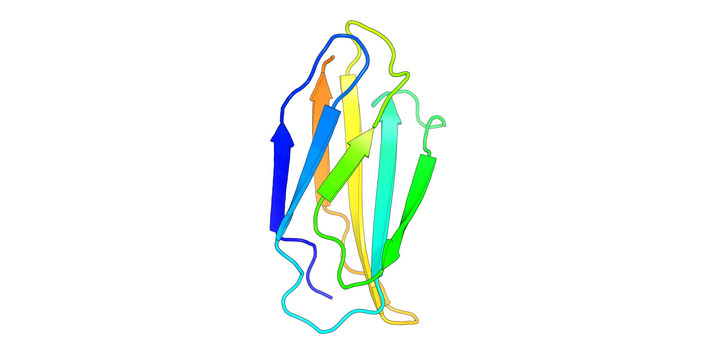
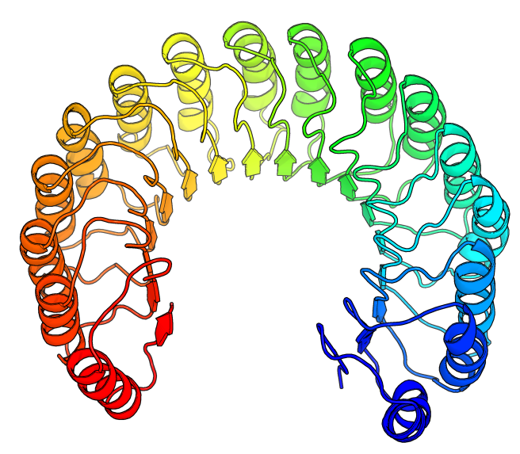
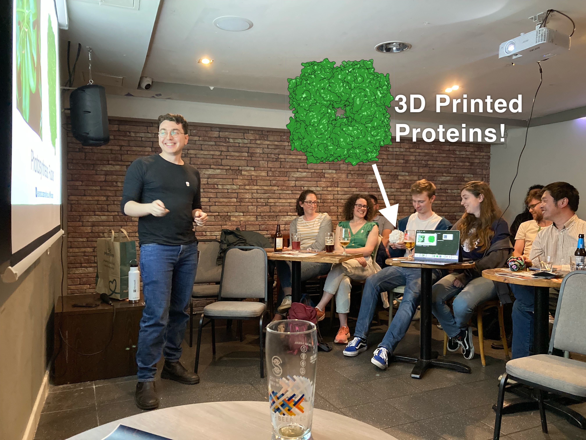

	 
  <h1>How to Create a Protein</h1> 

# Learning Objectives 
1. Understand what proteins are, what they do, what they are made of, and how their 3D shape dictates function
2. General understanding of protein folding and how it is dictated by amino acids properties
3. Understand the case for protein design, the large design space, and what are its potential applications

# Overview

## Background

Proteins are a fundamental part of life. They perform virtually all chemical reactions within a cell, from DNA replication, cell-to-cell signalling, energy production, and photosynthesis. They vary in physical consistency, as they are present in the shell of turtles, muscle fibres, and elastic tissue. 

Proteins are polymers made of twenty building blocks called amino acids, or residues, each with a different structure and chemical property. 

These amino acids interact to *fold* into distinct 3D structure: 

1. the **primary structure** of a protein is simply its linear sequence of amino acids. 
2. The **secondary structure** arises when backbone atoms begin to interact locally to form $\alpha$-helices (helical) and $\beta$-sheets (flat)
3. The **tertiary structure** refers to a protein's 3D shape and arises due to interactions with the side-chains (also R group)
4. Protein subunits interact (non-covalently) to form the **quaternary structure**.

Pictured above is Ubiquitin, a protein that contains both $\alpha$ and $\beta$ elements. As the name suggests, it is found virtually everywhere in eukaryotic organisms and performs important functions, such as signalling that a protein is ready for degradation. There are several ubiqutin-binding proteins, for example Vacuolar Protein Sorting-Associated Protein VPS23 (pictured in complex with Ubiquitin), which is involved in transporting proteins inside the cell.

## Protein Design

Protein design aims to engineer or redesign proteins for improving stability, acquiring new functions, or increasing binding specificity. 

For a protein 200 residues in length, there exists 2^260 (20^200) possible sequences. This number is larger than the number of people alive (8^9), the number of people that ever lived (1x10^11), and the number of atoms in the the universe (1x10^80). Combined. Therefore, a large portion of the protein universe is waiting to be explored that could help improve current protein-drugs, design antibodies to help us cure disease, or creating new materials.

Typically, designers are interested in:

1. Generating a 3D shape that performs a specific function
2. Generating the sequence of amino acids to obtain that 3D structure

In this course, you will piece together fragments of proteins to create a new protein. In a real design setting, you might instead use tools like [RFDiffusion](https://github.com/RosettaCommons/RFdiffusion) to generate 3D shapes, or  [TIMED](https://github.com/wells-wood-research/timed-design) to generate sequences. 

## Timetable

| Activity                    | Duration (mins) | Description                                                                                                                                           |
| --------------------------- | --------------- | ----------------------------------------------------------------------------------------------------------------------------------------------------- |
| Introduction                | 5               | Brief introduction to the course                                                                                                                      |
| Speed Friending Ice Breaker | 20              | Students chat for 3 minutes - 5 times.  In the remaining 5 minutes, each person says something about themselves and about the people they have met |
| How to Create a Protein     | 25              | Introduction to Proteins and Protein Design                                                                                                           |
| **BREAK**                   | 10              | **BREAK**                                                                                                                                             |
| Design your Protein         | 60              | [See section "Designing Proteins"](#designing-proteins)                                                                                               |

# Designing Proteins

## Goals 
1. Have fun (not optional)
2. Create a cool protein (option 1)
	1. Requirements:
		1. It has to be a combination of more than one designed units, meaning using Chroma to create a protein that looks like a letter is not enough. 
3. Create sequences that fold into these structures (option 2).
	- Requirements:
		1. Use at least 2 different proteins and a loop
		2. Cannot use sequences from the example structure or any structure in the same CATH group
		3. Cannot use Chroma or inverse folding software (e.g. TIMED, ProteinMPNN)

| Picture                                                    | Example PDB | CATH Name            | Fold Type       | Difficulty |
| ---------------------------------------------------------- | ----------- | -------------------- | --------------- | ---------- |
| HELIX-LOOP-HELIX                                           | -           | -                    | $\alpha$        | 1          |
| SHEET-LOOP-SHEET                                           | -           | -                    | $\beta$         | 1          |
|                                               | 3U7U        | Ribbon               | Mainly $\beta$  | 1          |
| (HELIX-LOOP-HELIX)4                                        | -           | -                    | $\alpha$        | 2          |
| (SHEET-LOOP-SHEET)4                                        | -           | -                    | $\beta$         | 2          |
|                                               | 3RO3        | Alpha Horseshoe      | Mainly $\alpha$ | 2          |
| HELIX-LOOP-SHEET-LOOP-SHEET-LOOP-HELIX  | 1BNH        | -                    | $\alpha\beta$   | 2          |
|                                               | 9ANT        | Orthogonal Bundle    | Mainly $\alpha$ | 3          |
|                                               | 1TEN        | Beta Sandwich        | Mainly $\beta$  | 3          |
|                                           | 1BNH        | alpha/beta horseshoe | $\alpha\beta$   | 4          |

**NB: In the table above, the sequence always starts from blue to red.**

## Approach 1: Frankeinstein
1. Go to https://www.rcsb.org
2. Click the number of structures available 
3. Scroll to find structures that interest you  
4. Click on the structure of interest 
5. Click on "Structure" to open the 3D structure 
6. Identify the 3D area that you are interested in, for example, this helix
	1. 
	2. 
7. To copy that helix we will need to extract the amino acid sequence
	1. Option 1: You can do this manually 
	2. Option 2: Click on "Download Files" and download the FASTA Sequence
		1. 
		2. You can open this with a text editor and copy and paste 
8. Copy the extracted sequence to a text file (text editor, word, etc.). For example, in this case I have the sequence "RHPGNFGADAQGAMNKALELFRKDIAAKYKELGY"
9. Repeat to find another structure of interest.
10. Combine the structures creatively. For example, to create a HELIX-LOOP-HELIX, you could do:
	1. Helix 1: "RHPGNFGADAQGAMNKALELFRKDIAAKYKELGY"
	2. Loop: "GGGGS"[see the Loops section below](#loops)
	3. Helix 2: "RHPGNFGADAQGAMNKALELFRKDIAAKYKELGY"
11. Now you'll have a full sequence: "RHPGNFGADAQGAMNKALELFRKDIAAKYKELGYGGGGSRHPGNFGADAQGAMNKALELFRKDIAAKYKELGY"
12. Use [AlphaFold3](https://alphafoldserver.com/about) (limit to 20 structures per day) or [ESMFold](https://esmatlas.com/resources?action=fold) (no limits) to fold the sequence. Did you get what you were expecting? If not, can you think of a reason why?
	1. 

## Approach 2: Chroma
1. Go to https://colab.research.google.com/github/generatebio/chroma/blob/main/notebooks/ChromaDemo.ipynb
2. Click on "Get API Key"
	1. 
3. Agree and add your the contact information 
	1. 
4. Copy the Token 
5. Paste it and run the cell by Clicking on the "Play" Button (or Shift+Enter) 
6. Explore different options available!

## Approach 3: Combine!
Use both approaches to come up with something cool!

## Loops
Loops are connecting elements between parts of proteins. As you've seen from the presentation, these can have several conformations. You can use sequences such as these as connectors between your $\alpha$-helices and $\beta$-sheets

(Source: https://doi.org/10.1007/s00253-015-6985-3)

# 3D Printing
Once you have created your `.pdb` file with , you can export it to `.stl` using [PyMol](https://pymol.org) (free for academic use). To do this:

1. Open PyMol
2. Open your `.pdb` file
3. In the menu on the right, click the "H" under the "All" object 
	1. 
4. Select "everything" to hide everything
	1. 
5. Your protein is now hidden as shown below:
	1. 
6. In the menu on the right, click on "S" and select "Surface" 
	1. 
7. Your protein will look like this:
	1. 
8. Click on File > Export Image As > STL 
	1. 
9. Save the file in a convenient location

STL files can then be opened in slicers (PrusaSlicer, Ultimaker Cura...) for 3D printing. Make sure to use supports. For better results, use PVA (soluble) supports.

# Hall of Fame
Have you followed this tutorial and designed your protein? Send us the `.pdb` file by opening an issue or by emailing Leo at name.lastname@ed.ac.uk (name = leonardo, lastname=castorina). 

# Credits

- Chris Wells Wood: Helpful discussions and feedback
- Molecular Biology of the Cell: Source for the Background and Overview Section
- Jaiden Deubner and Michael Bronstein: Background Image of the logo
 

