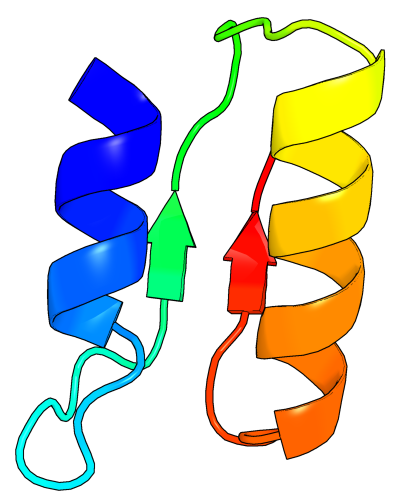
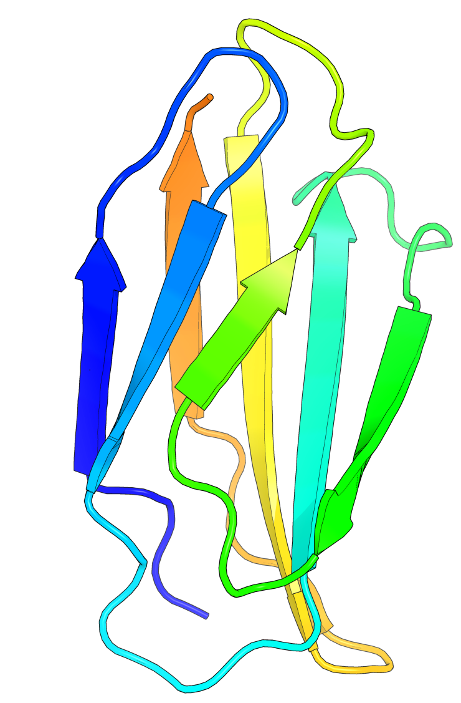

#  (Course) How to Create a Protein

## Learning Objectives 
1. Understand what proteins are, what they do, what they are made of, and how their 3D shape dictates function
2. General understanding of protein folding and how it is dictated by amino acids properties
3. Understand the case for protein design, the large design space, and what are its potential applications

## Overview

| Activity                    | Duration (mins) | Description                                                                                                                                           |
| --------------------------- | --------------- | ----------------------------------------------------------------------------------------------------------------------------------------------------- |
| Introduction                | 5               | Brief introduction to the course                                                                                                                      |
| Speed Friending Ice Breaker | 20              | Students chat for 3 minutes - 5 times.  In the remaining 5 minutes, each person says something about themselves and about the people they have met |
| How to Create a Protein     | 25              | Introduction to Proteins and Protein Design                                                                                                           |
| **BREAK**                   | 10              | **BREAK**                                                                                                                                             |
| Design your Protein         | 60              | See section "Designing Proteins"                                                                                                                      |

## Designing Proteins

### Goals 
1. Have fun (not optional)
2. Create a cool protein (option 1)
	1. Requirements:
		1. It has to be a combination of more than one designed units, meaning using Chroma to create a protein that looks like a letter is not enough. 
3. Create sequences that fold into these structures (option 2).
	- Requirements:
		1. Use at least 2 different proteins and a loop
		2. Cannot use sequences from the example structure or any structure in the same CATH group
		3. Cannot use Chroma or inverse folding software (e.g. TIMED, ProteinMPNN)

| Picture                                                    | Example PDB | CATH Name            | Fold Type       | Difficulty |
| ---------------------------------------------------------- | ----------- | -------------------- | --------------- | ---------- |
| HELIX-LOOP-HELIX                                           | -           | -                    | $\alpha$        | 1          |
| SHEET-LOOP-SHEET                                           | -           | -                    | $\beta$         | 1          |
|                                               | 3U7U        | Ribbon               | Mainly $\beta$  | 1          |
| (HELIX-LOOP-HELIX)4                                        | -           | -                    | $\alpha$        | 2          |
| (SHEET-LOOP-SHEET)4                                        | -           | -                    | $\beta$         | 2          |
|                                               | 3RO3        | Alpha Horseshoe      | Mainly $\alpha$ | 2          |
| HELIX-LOOP-SHEET-LOOP-SHEET-LOOP-HELIX  | 1BNH        | -                    | $\alpha\beta$   | 2          |
|                                               | 9ANT        | Orthogonal Bundle    | Mainly $\alpha$ | 3          |
|                                               | 1TEN        | Beta Sandwich        | Mainly $\beta$  | 3          |
|                                           | 1BNH        | alpha/beta horseshoe | $\alpha\beta$   | 4          |
**NB: In the table above, the sequence always starts from blue to red.**

### Approach 1: Frankeinstein
1. Go to https://www.rcsb.org
2. Click the number of structures available 
3. Scroll to find structures that interest you  
4. Click on the structure of interest 
5. Click on "Structure" to open the 3D structure 
6. Identify the 3D area that you are interested in, for example, this helix
	1. 
	2. 
7. To copy that helix we will need to extract the amino acid sequence
	1. Option 1: You can do this manually 
	2. Option 2: Click on "Download Files" and download the FASTA Sequence
		1. 
		2. You can open this with a text editor and copy and paste 
8. Copy the extracted sequence to a text file (text editor, word, etc.). For example, in this case I have the sequence "RHPGNFGADAQGAMNKALELFRKDIAAKYKELGY"
9. Repeat to find another structure of interest.
10. Combine the structures creatively. For example, to create a HELIX-LOOP-HELIX, you could do:
	1. Helix 1: "RHPGNFGADAQGAMNKALELFRKDIAAKYKELGY"
	2. Loop: "GGGGS" (see the Loops section below)
	3. Helix 2: "RHPGNFGADAQGAMNKALELFRKDIAAKYKELGY"
11. Now you'll have a full sequence: "RHPGNFGADAQGAMNKALELFRKDIAAKYKELGYGGGGSRHPGNFGADAQGAMNKALELFRKDIAAKYKELGY"
12. Use [AlphaFold3](https://alphafoldserver.com/about) (limit to 20 structures per day) or [ESMFold](https://esmatlas.com/resources?action=fold) (no limits) to fold the sequence. Did you get what you were expecting? If not, can you think of a reason why?
	1. 

### Approach 2: Chroma

#### Loops

Obtained from https://doi.org/10.1007/s00253-015-6985-3
